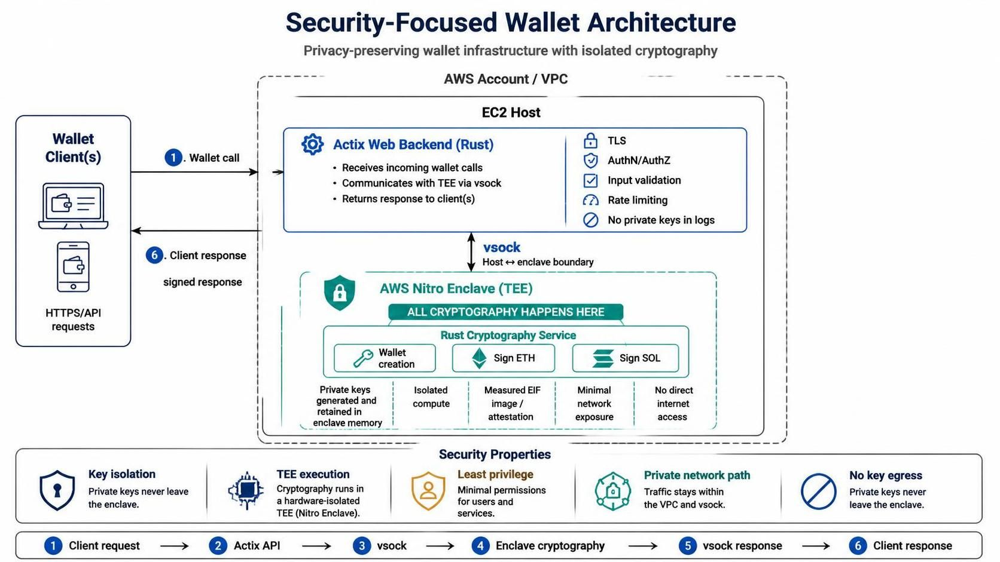

# Security-Focused Wallet Architecture



A privacy-preserving wallet infrastructure that isolates all cryptographic operations inside an AWS Nitro Enclave.

## Overview

The system consists of:

- **Actix Web backend written in Rust**
- **AWS Nitro Enclave trusted execution environment**
- **Rust cryptography service**
- **Secure vsock communication between the EC2 host and enclave**
- **Wallet operations for Ethereum and Solana**

Private keys are generated and used exclusively inside the Nitro Enclave. They are never exposed to the Actix Web backend, client applications, logs, or external network services.

## Request Flow

```text
Wallet Client
    │
    │  HTTPS/API request
    ▼
Actix Web Backend
    │
    │  vsock
    ▼
AWS Nitro Enclave
    │
    │  Cryptographic operation
    ▼
AWS Nitro Enclave
    │
    │  vsock response
    ▼
Actix Web Backend
    │
    │  Signed response
    ▼
Wallet Client
